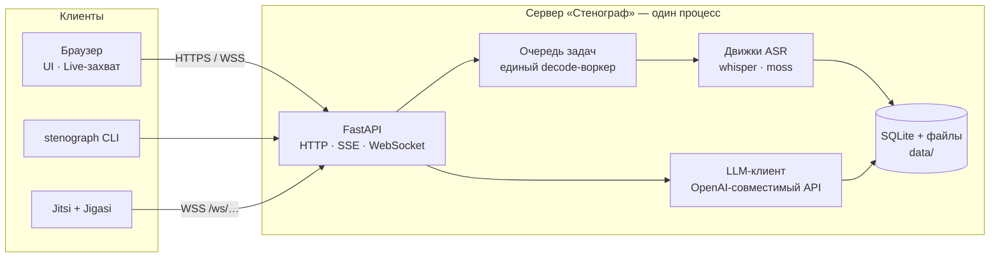
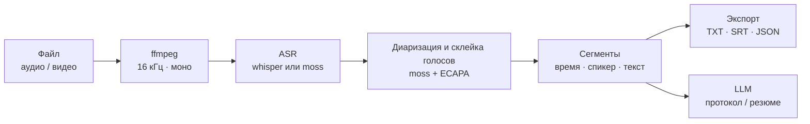
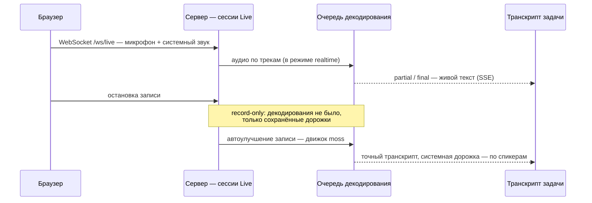
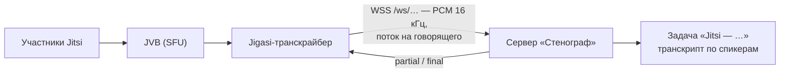

# Стенограф (Stenograph)

**Local-first система транскрибации встреч**: файлы, живая запись из браузера
и конференции Jitsi. Разделение спикеров, живые субтитры (в том числе в
интерфейсе Jitsi), экспорт транскриптов и LLM-протокол встречи. Распознавание
и обработка выполняются на собственном оборудовании — данные не покидают
контур.

## Возможности

- **Файлы** — аудио и видео в транскрипт с таймкодами и спикерами. Движки:
  `whisper` (faster-whisper) и `moss` (end-to-end ASR + диаризация за проход,
  со склейкой голосов между чанками). Экспорт TXT · SRT · JSON; любую задачу
  — в том числе упавшую — можно переобработать, история попыток сохраняется.
- **Live** — запись прямо из браузера: микрофон и звук системы/вкладки
  (Chrome/Edge), с любого компьютера сети. Несколько сессий одновременно;
  декодирование обслуживает общая очередь. Два режима: распознавание
  «на лету» (задержка ~1–2 с) или **record-only** — аудио сохраняется, а
  точный транскрипт формируется после остановки.
- **Jitsi** — штатный Jigasi заходит в конференцию виртуальным участником и
  передаёт аудио каждого говорящего. При живом декодировании субтитры
  partial/final возвращаются в интерфейс Jitsi; итог — транскрипт встречи по
  спикерам. Настройка — [docs/JITSI.md](docs/JITSI.md); развёртывание стека
  на Windows — [deploy/jitsi-windows](deploy/jitsi-windows/).
- **Анализ встречи** — локальная LLM (LM Studio или любой OpenAI-совместимый
  сервер) собирает **протокол** (тема, обсуждение, решения, задачи, открытые
  вопросы) или **резюме**. Длинные записи — map-reduce с прогрессом;
  результат — markdown с экспортом в `.md`.
- **Веб-интерфейс** — дашборд (активная задача, прогресс и ETA, очередь,
  статистика), история задач, живой транскрипт; имена задач и спикеров
  меняются на месте. HTTP API с SSE-событиями и CLI `stenograph`.
- **Монитор** — страница ресурсов (и `GET /api/metrics`): загрузка и память
  GPU (в том числе по процессам), загруженные модели с измеренным
  потреблением VRAM/RAM, очередь, эфир (Live-записи и Jitsi-встречи вместе)
  и доступность LLM-сервера.
  Нагрузочная проверка — `scripts/bench_monitor.py`.
- **Приоритеты эфира** — пока идёт живая запись или Jitsi-встреча, фоновые
  файлы и повторные обработки ждут очереди; движок `moss` уступает эфиру
  между чанками. Отставание живого текста измеряется по последнему сегменту.

## Архитектура

Сервер — один процесс: FastAPI, очередь задач, движки ASR, LLM-клиент и
SQLite. Веб-интерфейс (статическая сборка) отдаётся тем же процессом.



Конвейер обработки записи (файлы, а также автоулучшение Live/Jitsi):



## Требования

- **Windows 10/11 x64** — целевая платформа: серверный захват звука
  (WASAPI) и скрипты запуска (`.bat`). Серверную часть технически можно
  поднять и на Linux через `uvicorn` напрямую, но этот путь в репозитории не
  тестируется.
- **Python 3.12** и **Node.js 20+** (сборка веб-интерфейса).
- **ffmpeg / ffprobe** — как из PATH, так и по полному пути
  (`MEETSCRIBE_FFMPEG` / `MEETSCRIBE_FFPROBE`).
- **NVIDIA GPU (CUDA)** — практическая рекомендация: движки работают и на
  CPU, но существенно медленнее. Плюс место на диске под модели и записи.

## Быстрый старт

```bash
uv venv --python 3.12 .venv
uv pip install --python .venv/Scripts/python.exe -e ".[dev]"
cp .env.example .env      # каталог моделей, ffmpeg, движок — см. комментарии

cd frontend && npm install && npm run build && cd ..   # веб-интерфейс
```

Опционально — движок `moss` (torch из индекса PyTorch, сборка CUDA 13.0):

```bash
uv pip install --python .venv/Scripts/python.exe "torch==2.11.0" "torchaudio==2.11.0" --index-url https://download.pytorch.org/whl/cu130
uv pip install --python .venv/Scripts/python.exe -e ".[moss]"
```

Запуск сервера:

```bat
start_server.bat   ::  :443 при наличии certs\stenograph.crt + .key, иначе :8000
```

Эквивалент вручную (кроссплатформенно):

```bash
.venv/Scripts/python.exe -m uvicorn "stenograph.api.app:create_app" \
    --factory --host 0.0.0.0 --port 8000
```

CLI:

```bash
stenograph transcribe meeting.mp4            # транскрибация файла
stenograph analyze <job_id> --type protocol  # или summary
```

Модели скачиваются с Hugging Face автоматически либо берутся из локального
каталога (`MEETSCRIBE_MODELS_DIR` — раскладка описана в `.env.example`).

## Использование

### Live — запись из браузера

Запись идёт из браузера того, кто открыл страницу Live: **«Вы»** — микрофон,
**«Они»** — звук системы или вкладки (в окне выбора отметьте «Поделиться
звуком»; Chrome/Edge). Аудио стримится на сервер (WebSocket) и сохраняется
дорожками в `data/live/<job>/`. Записывать могут несколько человек
одновременно — каждый со своей машины; декодирование обслуживается общей
очередью (её позиция и отставание видны на странице); аудио при этом
сохраняется полностью. Перед стартом можно задать название встречи; в шапке
виден таймер записи. Переход по другим страницам сервиса запись не прерывает; остановить
её можно со страницы Live или из «Задач».

Записи получают имя «Live — Chrome · Windows — 8 окт, 23:41 — Название»
(название — в конце), а в метаданных задачи сохраняется отчёт клиента:
браузер и ОС (разобранные из user agent), язык, таймзона, экран, IP и метки
захваченных аудиоустройств (`meta.client`, `meta.capture_devices`).

Режимы:

- **Realtime** (`MEETSCRIBE_REALTIME_TRANSCRIBE=true`) — текст появляется по
  ходу записи (модель `large-v3-turbo`, задержка ~1–2 с).
- **Record-only** (по умолчанию) — во время записи декодирования нет; после
  остановки запись автоматически проходит качественную транскрибацию
  (`moss`) в общей очереди.



Микрофонная дорожка подписывается «Вы», системная проходит диаризацию.
Автоулучшение отключается настройкой `MEETSCRIBE_LIVE_AUTO_REPROCESS=false`;
кнопка «Улучшить» на странице задачи доступна всегда. Серверный (WASAPI)
захват — один на сервер. Браузеры дают доступ к микрофону только на HTTPS —
см. «HTTPS и сертификаты».

### Jitsi — субтитры и транскрипт конференции

Конференция размещается на собственном Jitsi (docker-jitsi-meet); на стороне
стека включается профиль `transcriber.yml` (jigasi-транскрайбер):

```bash
ENABLE_TRANSCRIPTIONS=1
JIGASI_TRANSCRIBER_CUSTOM_SERVICE=org.jitsi.jigasi.transcription.WhisperTranscriptionService
JIGASI_TRANSCRIBER_WHISPER_URL=wss://<адрес-сервера-стенографа>/ws
PREFERRED_LANGUAGE=ru-RU   # язык распознавания
USE_APP_LANGUAGE=0         # не подменять языком интерфейса
```



В комнате субтитры включаются модератором: **More actions → Closed captions →
Start closed captions**. Jigasi заходит скрытым участником; встреча
сохраняется задачей «Jitsi — 8 окт, 23:41 — <комната>» в «Стенографе»
(название комнаты — в конце имени и в `meta.room`) с транскриптом по
спикерам. Протокол обмена, требования к сертификату и диагностика — в
[docs/JITSI.md](docs/JITSI.md).

### Анализ встречи

По завершённой задаче (файл, Live или Jitsi) — кнопки «Составить протокол» /
«Сделать резюме» на странице задачи; результат доступен как markdown и как
отдельная задача «Анализ» в истории.

## HTTPS и сертификаты

Браузеры дают доступ к микрофону только на HTTPS (исключение — localhost),
поэтому сервер отдаёт TLS сам — **без прокси**: при наличии сертификата
`start_server.bat` слушает `:443` (uvicorn со встроенным TLS) и обслуживает
всё — страницы, API, SSE и мост для Jigasi (`wss://<адрес>/ws/<meeting>`).
Без сертификата сервер стартует на HTTP `:8000` (для Live с других машин
этого недостаточно).

Сертификат — конфигурация, а не код:

- по умолчанию берутся `certs/stenograph.crt` + `certs/stenograph.key`;
- пути переопределяются переменными `TLS_CERT_FILE` / `TLS_KEY_FILE`;
- подходит любой X.509 PEM: локальный CA, корпоративный CA, Let's Encrypt;
  SAN должен включать адрес, по которому заходят клиенты, и
  `host.docker.internal` — его используют контейнеры Jigasi
  (`scripts/make_cert.sh` уже добавляет его в SAN);
- после замены файлов сервер нужно **перезапустить** — сертификат читается
  на старте;
- выпуск/перевыпуск из локального CA: `scripts/make_cert.sh <IP-или-имя>`
  (CA по умолчанию — `~/stenograph-ca`, каталог переопределяется переменной
  `CA_DIR`).

Клиентам нужно один раз добавить `ca.crt` в доверенные:

```bat
certutil -user -addstore -f Root <путь>\ca.crt
```

Сторона Jitsi должна доверять сертификату `wss`-моста: в Jitsi-стендах CA
кладётся в `custom-ca` контейнера, а для Java дополнительно собирается
объединённое JVM-хранилище (детали — [docs/JITSI.md](docs/JITSI.md) и
[deploy/jitsi-windows/README.md](deploy/jitsi-windows/README.md)).

> Исторический вариант с Caddy (`start_https.bat` + `Caddyfile`) больше не
> нужен: TLS встроен в сервер. Файлы оставлены для справки; запускать их
> вместе с сервером нельзя (конфликт по порту 443).

## HTTP API

Формат — JSON; события — SSE (`GET /api/jobs/{id}/events`) и WebSocket
(`/ws/live`, `/ws/{meeting}`). Полная спецификация — Swagger UI (`/docs`) и
`/openapi.json` на работающем сервере. Основное:

| Группа | Эндпоинты |
|---|---|
| Задачи | `GET/POST /api/jobs`, `GET/DELETE/PATCH /api/jobs/{id}`, `POST /api/jobs/{id}/cancel · retry · reprocess · analyze`, `GET /api/jobs/{id}/audio[/{track}]` |
| Live | `POST /api/live/start · stop`, `GET /api/live/status · devices`, `WS /ws/live` |
| Jitsi | `GET /api/jitsi/status`, `POST /api/jitsi/transcribe · stop`, `WS /ws/{meeting}` |
| Служебные | `GET /api/health · config · engines · queue · stats · metrics` |

## Настройки

Все параметры — переменные `MEETSCRIBE_*` в `.env` (полный список с
комментариями — в [.env.example](.env.example)). Читаются один раз при
старте процесса.

| Переменная | По умолчанию | Назначение |
|---|---|---|
| `MEETSCRIBE_ENGINE` | `whisper` | движок по умолчанию: `whisper` или `moss` |
| `MEETSCRIBE_REPROCESS_ENGINE` | — | движок повторной обработки (иначе — движок по умолчанию) |
| `MEETSCRIBE_DATA_DIR` | `./data` | задачи, загрузки, БД, аудио |
| `MEETSCRIBE_MODELS_DIR` | — | каталог локальных моделей (иначе — загрузка с HF) |
| `MEETSCRIBE_FFMPEG` / `MEETSCRIBE_FFPROBE` | `ffmpeg` / `ffprobe` | пути к бинарям |
| `MEETSCRIBE_DEVICE` / `MEETSCRIBE_COMPUTE_TYPE` | `cuda` / `float16` | устройство и точность faster-whisper |
| `MEETSCRIBE_LANGUAGE` | `auto` | язык распознавания |
| `MEETSCRIBE_LIVE_MODEL` | `large-v3-turbo` | модель живого декодирования (Live/Jitsi) |
| `MEETSCRIBE_REALTIME_TRANSCRIBE` | `false` | декодирование Live/Jitsi по ходу записи (иначе record-only) |
| `MEETSCRIBE_JITSI_IDLE_STOP_SEC` | `600` | авто-стоп Jitsi-встречи после N секунд без речи (`0` — выключено) |
| `MEETSCRIBE_RESTART_RECOVER` | `true` | подхват работы, пережившей остановку сервера: очередь возвращается, прерванные перезапускаются (иначе — только пометка «Прервано») |
| `MEETSCRIBE_LIVE_AUTO_REPROCESS` | `true` | автоулучшение записей Live через `moss` после остановки |
| `MEETSCRIBE_LIVE_TURN_TICKS` / `MEETSCRIBE_LIVE_TURN_SEC` | `6` / `2.0` | лимит работы одной сессии за ход очереди |
| `MEETSCRIBE_LLM_BASE_URL` | `http://127.0.0.1:1234/v1` | OpenAI-совместимый сервер для анализа |
| `MEETSCRIBE_LLM_MODEL` | `gemma-3-4b-it` | модель анализа |

## Перезапуск сервера

Очередь задач живёт в памяти процесса. При старте сервер подхватывает работу,
осиротевшую после предыдущей остановки (`MEETSCRIBE_RESTART_RECOVER`, по
умолчанию включено): задачи из очереди возвращаются на свои места, а
прерванные на выполнении перезапускаются с нуля **в той же задаче** (прогресс
сбрасывается, дублей в истории нет; повторяются только «В очереди» и
«Выполняется» — отменённые и завершённые не трогаются). Записи Live/Jitsi
возобновить нельзя: они помечаются «Прервано остановкой сервера», аудио на
диске сохраняется, транскрипт можно построить кнопкой «Улучшить». С
`MEETSCRIBE_RESTART_RECOVER=false` сервер только помечает такие задачи,
ничего не перезапуская. Факт восстановления виден в логе строкой
`restart recovery: N requeued, M restarted, K marked interrupted`.

## Структура репозитория

```
src/stenograph/     сервер и ядро
├── domain/         модели и ошибки
├── engines/        ASR/диаризация за протоколами + реестр движков
├── live/           Live: браузерный захват + WASAPI, потоковые сессии
├── bridge/         Jitsi-мост: streaming-whisper для Jigasi
├── llm/            анализ встречи: клиент, промпты, map-reduce
├── api/            FastAPI: HTTP + SSE + WebSocket
├── service.py      очередь задач, воркер, отмена
├── pipeline.py     стадии обработки, переходы состояний
├── storage.py      SQLite-репозиторий задач (WAL)
├── events.py       шина событий (SSE/WebSocket)
└── cli.py          консоль `stenograph`
frontend/           веб-интерфейс (React 19 + TypeScript + Vite)
deploy/             развёртывание: стек Jitsi + Jigasi на Windows
docs/               JITSI.md, ARCHITECTURE.md
scripts/            служебные скрипты (сертификаты, проверки)
tests/              автотесты (pytest)
```

Движки подключаются как плагины: новый — модуль с реализацией протоколов из
`engines/base.py` плюс регистрация в `engines/__init__.py`; ядро о конкретных
моделях не знает. Подробнее о слоях и потоках —
[docs/ARCHITECTURE.md](docs/ARCHITECTURE.md).

## Разработка

```bash
.venv/Scripts/python.exe -m pytest        # автотесты
uv run ruff check src tests               # стиль
uv run mypy src                           # типы
cd frontend && npx tsc --noEmit           # типы фронтенда
```

## Ограничения

- Серверный захват звука (WASAPI) — Windows; такая сессия — одна на сервер
  (браузерных Live-сессий — сколько угодно).
- Единая очередь декодирования: «тяжёлые» задачи выполняются
  последовательно; Live и Jitsi имеют приоритет перед фоновыми файлами.
- Транскрибация встреч в Jitsi возможна только для собственного Jitsi с
  Jigasi; для внешних встреч — захват системного звука через Live.
- Движок `moss` требует extra `[moss]` и CUDA-сборки torch (см. «Быстрый
  старт»).

## Состояние и развитие

Реализовано: ядро и файловая транскрибация (`whisper` + `moss` с диаризацией
и склейкой голосов), веб-интерфейс, Live (браузерный и WASAPI-захват) с
автоулучшением, Jitsi-мост через Jigasi, LLM-анализ, HTTPS с нативным TLS.

Планы: масштабирование на несколько воркеров, вынос ASR-движков во внешние
сервисы, тонкая настройка промптов под корпоративные шаблоны протоколов.
