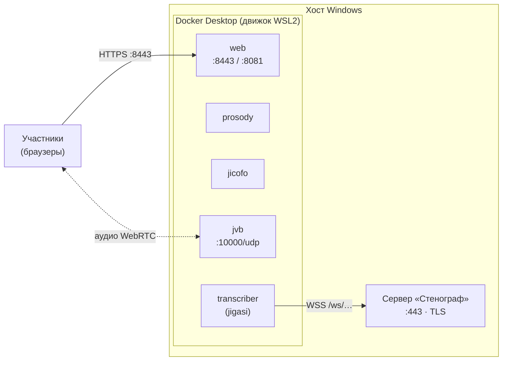
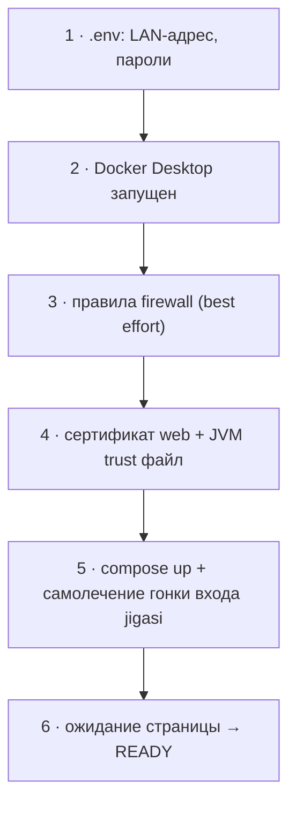
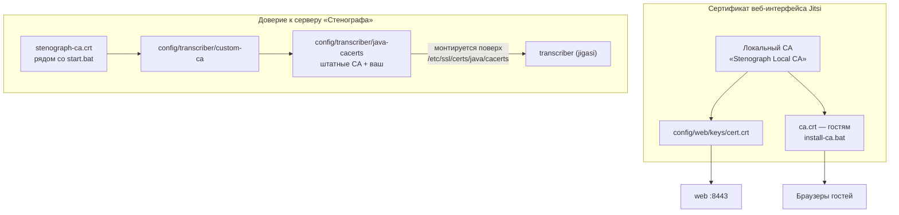

# Jitsi + Jigasi в Docker на Windows

Развёртывание стека **Jitsi Meet** (web, prosody, jicofo, jvb) с
транскрайбером **jigasi**, который передаёт аудио участников серверу
транскрибации **«Стенограф»** по протоколу streaming-whisper. Настройка и
запуск автоматизированы скриптом `start.bat`; стек работает в Docker Desktop.



## Платформа

- Целевая платформа `docker-jitsi-meet` — Linux. На Windows стек работает
  через Docker Desktop (бэкенд WSL2); этого достаточно для стендов и
  небольших развёртываний. Для крупных встреч (десятки–сотни участников)
  рекомендуется Linux-хост: UDP-медиа через WSL2 и firewall добавляют
  платформенные ограничения (см. «Диагностика»).
- Первый запуск скачивает ~1,5 ГБ образов из ghcr.io.
- Пароли и ключи генерируются на машине при первом запуске; `.env`,
  `config\`, `ca\` и `stenograph-ca.crt` в git не попадают (см. `.gitignore`).

## Требования

- Windows 10/11 x64, в BIOS включена виртуализация (VT-x / AMD-V).
- **Docker Desktop** с Linux-контейнерами: `winget install Docker.DockerDesktop`
  (или https://www.docker.com/products/docker-desktop/; при первом запуске —
  бэкенд WSL2). Лицензия Docker Desktop: бесплатно для личного и
  образовательного использования и небольших компаний; крупным организациям
  требуется платная подписка (docker.com/pricing).
- ~2–4 ГБ свободной RAM (стек занимает ~2 ГБ).
- Свободные порты: **8081/tcp**, **8443/tcp**, **10000/udp** (плюс 8080 и
  8888, слушаются только на 127.0.0.1). Если заняты — изменить `HTTP_PORT` /
  `HTTPS_PORT` / `JVB_PORT` в `.env`.
- Сервер «Стенографа», доступный из контейнеров (по умолчанию — на том же
  хосте; см. «Интеграция»).
- Опционально: **Git for Windows** — из его OpenSSL `start.bat` выпускает
  доверенный локальный сертификат. Без Git стек поднимается на встроенном
  самоподписанном сертификате.

## Запуск и остановка

1. Запустить `start.bat` (при первом запуске — от имени администратора,
   чтобы добавить правила Windows Firewall).
2. Дождаться строки `READY` — в ней указан адрес веб-интерфейса.
3. Открыть адрес, создать комнату (имя после слэша, латиницей).

Остановка — `stop.bat` (данные в `config\` и образы сохраняются). Повторный
запуск `start.bat` идемпотентен. Неинтерактивный режим:
`set STENOGRAPH_NOPAUSE=1`.

`start.bat` выполняет шесть шагов:



1. создаёт `.env` — LAN-адрес машины и случайные пароли (если файла нет);
2. проверяет Docker Desktop и при необходимости запускает его;
3. добавляет правила Windows Firewall для 8443/tcp, 8081/tcp, 10000/udp
   (без прав администратора шаг пропускается);
4. выпускает сертификат от локального CA «Stenograph Local CA» и собирает
   JVM-хранилище доверия для transcriber (см. «Интеграция»);
5. поднимает контейнеры и компенсирует гонку первого запуска: если jigasi
   обратился к prosody раньше создания своей учётной записи (`not-authorized`
   в логе), контейнер `transcriber` перезапускается автоматически;
6. дожидается ответа веб-интерфейса и печатает адрес.

## Доступ

- Адрес и порт — из `.env` (`PUBLIC_URL`, по умолчанию
  `https://<IP-машины>:8443`); `start.bat` печатает его по завершении.
- Комната — любое имя после слэша: `https://<IP-машины>:8443/RoomName`.
- Смена адреса/портов: правка `.env` → повторный `start.bat`. После смены
  IP сертификат нужно перевыпустить (см. ниже).

## Сертификаты

Две независимые цепочки доверия: браузеры участников доверяют сертификату
веб-интерфейса Jitsi, контейнер `transcriber` — сертификату сервера
«Стенографа».



По умолчанию пакет создаёт собственный центр сертификации
(«Stenograph Local CA», папка `ca\`) и выпускает сертификат на LAN-IP
машины. Чтобы у пользователей не было предупреждений браузера:

1. передать им `ca\ca.crt` и `install-ca.bat`;
2. пользователь запускает `install-ca.bat` (без прав администратора —
   установка в хранилище текущего пользователя), полностью закрывает
   браузер и открывает страницу заново.

**Свой сертификат.** Чтобы стек отдавал уже имеющийся сертификат,
положить в `config\web\keys\` два файла: `cert.crt` (сертификат; при наличии
цепочки — лист первым) и `cert.key` (приватный ключ, PEM, без пароля),
перезапустить веб-контейнер:

```bat
docker compose -f docker-compose.yml -f transcriber.yml restart web
```

Сертификат должен покрывать адрес, по которому заходят пользователи
(SAN с IP или доменом), иначе браузер покажет предупреждение. С
публичным/корпоративным сертификатом пользователям ничего устанавливать
не нужно.

**Свой подписывающий CA.** Чтобы выпускать сертификаты своим центром
(например, общим для Jitsi и «Стенографа»): положить в `ca\` пару
`ca.crt` + `ca.key` (ключ без пароля), удалить `config\web\keys\cert.crt`
и `cert.key`, запустить `start.bat` — сертификат будет выпущен из этого
CA. Проверка фактически отдаваемого сертификата:

```bash
echo | openssl s_client -connect 127.0.0.1:8443 2>/dev/null | openssl x509 -noout -subject -issuer
```

## Интеграция с сервером «Стенографа»

Jigasi работает в режиме транскрайбера и подключается к серверу
«Стенографа» по WebSocket. Адрес задаётся в `.env`:

```ini
JIGASI_TRANSCRIBER_WHISPER_URL=wss://host.docker.internal/ws
```

- По умолчанию «Стенограф» отдаёт HTTPS сам (нативный TLS, `:443`), поэтому
  используется `wss://`. `host.docker.internal` — обращение к хостовой
  машине (Docker Desktop). Если «Стенограф» работает на другом сервере —
  указать его адрес (`wss://<адрес>/ws`).
- Сертификат сервера должен покрывать это имя/адрес (SAN). Пакетный
  `scripts/make_cert.sh` включает `DNS:host.docker.internal` в SAN.
- Чтобы Jigasi доверял сертификату, положить его `ca.crt` (PEM) рядом с
  `start.bat` под именем **`stenograph-ca.crt`** — `start.bat` скопирует файл
  в `config\transcriber\custom-ca\` и **пересоберёт JVM-хранилище доверия**
  (`config\transcriber\java-cacerts`), которое `transcriber.yml` монтирует
  поверх системного. Шаг обязателен: Jetty-клиент внутри jigasi читает
  встроенное JVM-хранилище и игнорирует кастомные trust store. При ручной
  правке: после замены файла в `custom-ca\` удалить
  `config\transcriber\java-cacerts` и запустить `start.bat`.
- Для сервера без TLS (HTTP `:8000`) изменить адрес на
  `ws://host.docker.internal:8000/ws` — CA в этом случае не нужен.
- Транскрипция включается в комнате модератором: **More actions →
  Closed captions → Start closed captions**. Jigasi заходит скрытым
  участником и передаёт аудио каждого говорящего; в «Стенографе» появляется
  живая задача «Jitsi — …».
- Описание протокола — `docs/JITSI.md`.

Проверка:

```bat
docker ps                                              :: 5 контейнеров Up
docker logs docker-jitsi-meet-transcriber-1 --tail 50  :: искать "Successfully connected"
docker exec docker-jitsi-meet-transcriber-1 sh -c ". /run/ca/env 2>/dev/null; wget -qO- https://host.docker.internal/api/health"
```

## Диагностика

| Симптом | Действие |
|---|---|
| `start.bat`: Docker Desktop не поднялся | Открыть Docker Desktop вручную, дождаться «Engine running», повторить |
| Участники не соединяются (ICE failed) | Проверить, что UDP 10000 свободен и разрешён (firewall, антивирус). На Windows 11 можно включить зеркальный режим сети WSL: `%UserProfile%\.wslconfig` → `[wsl2]` + `networkingMode=mirrored`, затем `wsl --shutdown` и перезапуск Docker Desktop |
| Предупреждение сертификата у пользователей | Раздать `ca.crt` + `install-ca.bat` либо использовать свой сертификат (см. выше) |
| Порт занят | Поменять `HTTP_PORT`/`HTTPS_PORT` в `.env`, перезапустить `start.bat` |
| Субтитры не идут | `docker logs docker-jitsi-meet-transcriber-1`; проверить `JIGASI_TRANSCRIBER_WHISPER_URL`; см. `docs/JITSI.md` |
| В логе jigasi `PKIX path building failed` | JVM-хранилище доверия не собрано: проверить, что `stenograph-ca.crt` лежит рядом со `start.bat`, удалить `config\transcriber\java-cacerts`, запустить `start.bat` |
| Логи | `docker compose -f docker-compose.yml -f transcriber.yml logs -f web jvb transcriber` |
| Обновление образов | `docker compose -f docker-compose.yml -f transcriber.yml pull` + `up -d`. Фиксация версии: `JITSI_IMAGE_VERSION=stable-XXXX` в `.env` (по умолчанию `unstable`) |

## Состав каталога

| Файл | Назначение |
|---|---|
| `start.bat` | Первичная настройка и запуск стека |
| `stop.bat` | Остановка стека (данные сохраняются) |
| `.env.template` | Шаблон конфигурации без секретов; `.env` создаётся при первом запуске |
| `prepare_env.ps1` | Генерация `.env`: LAN-IP и случайные пароли |
| `make_cert.sh` | Выпуск сертификата от локального CA (вызывается из `start.bat`; нужен Git) |
| `install-ca.bat` | Для пользователей: установка `ca.crt` в доверенные (без прав администратора) |
| `docker-compose.yml` | Базовый стек из проекта `docker-jitsi-meet` (Apache-2.0) |
| `transcriber.yml` | Override: добавляет контейнер `transcriber` (jigasi) |
| `config\` | Состояние и конфигурация контейнеров (не коммитится) |
| `ca\` | Локальный CA и ключи (не коммитится) |

## Ограничения

- Субтитры включаются вручную модератором.
- Одновременно эффективно одна тяжёлая встреча: распознавание выполняется
  на стороне сервера «Стенографа» (GPU), остальное встаёт в очередь.
- Транскрибация возможна только для встреч в этом Jitsi; для внешних
  встреч — только локальный захват в самом «Стенографе».

## Происхождение

`docker-compose.yml` — из проекта
[docker-jitsi-meet](https://github.com/jitsi/docker-jitsi-meet)
(Apache-2.0). `transcriber.yml` — override-файл, включающий сервис
`transcriber` (образ jigasi) со штатным `WhisperTranscriptionService`.
