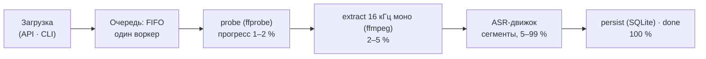

# Архитектура «Стенографа»

Документ описывает слои, потоки данных и принятые решения. Состояние — по
текущей реализации в репозитории.

## Слои и зависимости

```
domain/     модели и ошибки; ни от чего не зависят
engines/    протоколы + реализации ASR/диаризации + реестр
media.py    ffmpeg: probe, извлечение 16 кГц моно
storage.py  SQLite-репозиторий задач (WAL, версия схемы)
events.py   шина событий (fan-out, потокобезопасная)
pipeline.py стадии файловой задачи + переходы состояний
service.py  очередь (FIFO), один GPU-воркер, отмена
live/       Live-сессии: захват, потоковое декодирование, очередь ходов
bridge/     Jitsi-мост: WebSocket-сервер streaming-whisper для Jigasi
llm/        анализ встречи: клиент, промпты, map-reduce
api/        FastAPI: тонкие роутеры, SSE, WebSocket
cli.py      тот же конвейер из командной строки
```

Зависимости направлены вниз: `api/cli → service → pipeline → engines →
domain`. Обратных зависимостей нет. Ядро не знает о конкретных моделях:
ASR- и диаризация-движки подключаются за протоколами (`engines/base.py`)
через реестр (`engines/__init__.py`); новый бэкенд — новый модуль.

## Конвейер файловой задачи



Прогресс сохраняется в БД с троттлингом (~1 с) для списка задач; в SSE
события уходят по мере поступления. Отмена — кооперативная:
`threading.Event`, движок проверяет его между сегментами и бросает
`JobCancelled`.

## Очередь и приоритеты

- Все задачи декодирует один воркер (`service.py`). Файлы и повторные
  обработки выполняются строго последовательно.
- Живое декодирование (Live-сессии, Jitsi-мост) обслуживается той же
  очередью с приоритетом: сессии получают ходы по кругу (до
  `live_turn_ticks` инференсов и `live_turn_sec` секунд GPU на сессию за
  ход), окна растранскрибирования объединяются в батч-проходы (до
  `live_batch_max` окон за проход, аудио окна — до `live_batch_window_sec`;
  мост использует аналогичные окна `bridge_batch_window_sec`). Это исключает
  запуск N параллельных потоков whisper: под нагрузкой текст приходит с
  задержкой, аудио при этом сохраняется и догоняется в очереди.
- Пока активен эфир (идёт живая запись или Jitsi-встреча), фоновые файлы и
  повторные обработки не стартуют («Ждёт: идёт живая запись» в списке);
  движок `moss` проверяет отмену между чанками и уступает эфиру.
- Позиция в очереди и отставание live-сессий отдаются в
  `GET /api/live/status` (`sessions[].queue_position` / `lag_sec`).

## Движки

**whisper** (faster-whisper). Файлы — `large-v3` (устройство и точность —
`MEETSCRIBE_DEVICE` / `MEETSCRIBE_COMPUTE_TYPE`); Live/Jitsi —
`large-v3-turbo`, greedy. Батч-декод окон live-очереди использует приватные
внутренности faster-whisper (`BatchedInferencePipeline` без VAD) — при
обновлении библиотеки перепроверять.

**moss** (MOSS-Transcribe-Diarize). ASR + диаризация за проход. Длинные
записи режутся на чанки по 300 с с перехлёстом 2 с; дубликаты на границах
снимаются по времени и схожести текста. Метки спикеров локальны для чанка,
поэтому после декодирования всех чанков выполняется сквозная склейка
голосов: сегменты ≥0.8 с эмбеддятся ECAPA-TDNN (speechbrain, CPU),
кластеризация average-linkage по косинусу; кластеры короче 10 с речи
приклеиваются к ближайшему похожему, иначе сохраняются отдельными.
Одночанковые записи не затрагиваются. При ошибке эмбеддера — warning и
локальные метки (транскрибация не падает). Движок требует extra `[moss]`
и CUDA-сборки torch.

**LLM** (протокол/резюме). OpenAI-совместимый клиент; длинные транскрипты
обрабатываются map-reduce по чанкам (`MEETSCRIBE_LLM_CHUNK_CHARS`).

Движок по умолчанию — `MEETSCRIBE_ENGINE`; повторная обработка — отдельный
параметр `MEETSCRIBE_REPROCESS_ENGINE` (если не задан — движок по умолчанию).

## Live-режим

**Захват.** Браузерный: `getUserMedia` (микрофон → «Вы») + `getDisplayMedia`
(звук системы/вкладки → «Они»), 16 кГц моно, кадры ~100 мс в
`WS /ws/live`. Серверный: PyAudioWPatch/WASAPI — loopback устройства вывода
(«Они») + микрофон («Вы»), чанки 0.2 с; одновременно не более одной
серверной сессии (устройства машины общие). Браузерных сессий — сколько
угодно. Библиотека `soundcard` не используется: зависает при открытии
loopback некоторых Bluetooth-устройств.

**Режимы.** `MEETSCRIBE_REALTIME_TRANSCRIBE=true` — декодирование по ходу
записи; `false` (по умолчанию) — record-only: во время записи сохраняется
только аудио, транскрипт формируется после остановки.

**Декодирование** (realtime). `StreamTracker` на каждый трек: окно
нестабильного аудио, инференс раз в `live_step_sec` (0.8 с), коммит слов,
согласованных в двух последовательных гипотезах (LocalAgreement-2); тишина
отсекается по RMS; закоммиченное аудио выбрасывается из окна, переросшее
окно коммитится принудительно. Модель — whisper-turbo, greedy.

**Сессия** — задача (`kind="live"`): тот же SSE-контракт (плюс события
`partial` и `level`), дорожки в `data/live/<id>/<track>.wav`. Захват живёт в
модульном сторе фронтенда (`frontend/src/live/session.ts`), а не в
компоненте страницы: переход по вкладкам запись не прерывает. Остановить
сессию можно откуда угодно (`/api/live/stop` с `job_id`; сервер закрывает
upload-сокет).

**Повторная обработка.** После остановки создаётся дочерняя задача
(`kind="reprocess"`): дорожки перетранскрибируются движком повторной
обработки, сегменты сливаются в общий таймлайн — микрофон помечается «Вы»,
системная дорожка сохраняет диаризованные метки. Связь — `meta.parent` /
`meta.reprocess_job`; автозапуск — `MEETSCRIBE_LIVE_AUTO_REPROCESS`.

## Jitsi-мост

Jigasi в режиме транскрайбера подключается к `WS /ws/{meeting_id}` и шлёт
бинарные кадры: заголовок 60 байт `participantId|language` + PCM 16 кГц;
ответы — JSON `{"type": "partial"|"final", ...}` (протокол
jitsi/skynet streaming-whisper, Apache-2.0). Идентификатор говорящего
приходит в заголовке, поэтому акустическая диаризация не нужна: спикеры —
по участникам. Мост ведёт выровненный по часам встречи таймлайн: кадры
ставятся на позицию «приход − длительность», паузы заполняются тишиной;
итог — дорожки полной длины, микс «вся встреча» и та же временная шкала у
транскрипта. Детали и диагностика — `docs/JITSI.md`.

## Веб-интерфейс

React 19 + TypeScript + Vite 7 + Tailwind 4; сборка в `frontend/dist`
раздаётся тем же FastAPI (SPA-fallback; API-роуты приоритетны, неизвестные
`/api/*` — 404). В dev-режиме `npm run dev` проксирует `/api` на `:8000`.
Данные: дашборд — `/api/stats` + `/api/queue` (поллинг ~2 с, ETA считается
на клиенте); страница задачи — `/api/jobs/{id}/events` (SSE: snapshot →
status/progress/segment → segments_replaced → done/error). Контракт событий
тот же, что у CLI.

## Хранилище и события

SQLite (WAL) — задачи, сегменты, метаданные (`meta.*`: имена спикеров, связи
задач, движок). `events.py` — потокобезопасная шина fan-out: SSE-потоки,
WebSocket-подписки Live/Jitsi и CLI получают одни и те же события.

## Принятые решения

1. ASR и диаризация — локально в процессе приложения: у LM Studio нет
   STT-эндпойнта, генеративные LLM для аудио не годятся.
2. Текстовые LLM — внешний OpenAI-совместимый сервис: снимает конкуренцию
   за VRAM, версии transformers и обновления моделей.
3. Спикеры Live/Jitsi берутся из источника (дорожки / participant id), а не
   акустической диаризацией на лету.
4. Единый декод-воркер с приоритетом эфира (см. «Очередь»); сохранность
   аудио при задержках обеспечивается буферизацией и догоном в очереди.
5. TLS терминирует сам сервер (uvicorn, `:443`); внешний прокси не нужен —
   страницы, API, SSE и мост Jigasi живут на одном порту.
