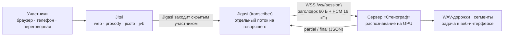

# Jitsi: интеграция через Jigasi

Jitsi не отдаёт аудио конференции наружу. Интеграция построена на штатном
компоненте **Jigasi** в режиме транскрайбера: он входит в комнату скрытым
участником, получает аудио каждого говорящего отдельным потоком и передаёт
его внешнему сервису распознавания по открытому протоколу streaming-whisper
(тем же, что использует проект `jitsi/skynet`). «Стенограф» реализует этот
протокол; в Jitsi изменения не вносились — только конфигурация штатного
механизма.

## Схема потока



Субтитры идут по цепочке Jitsi → Jigasi → Стенограф → Jigasi → Jitsi;
параллельно «Стенограф» сохраняет полный транскрипт встречи.

## Последовательность работы

1. Модератор включает субтитры («More actions» → «Closed captions» →
   «Start closed captions»); Jitsi поднимает транскрайбер-сессию.
2. Jigasi подключается к комнате скрытым участником и открывает WebSocket к
   «Стенографу» (адрес — `whisper.websocket_url` его конфигурации).
3. Аудио каждого говорящего приходит отдельным потоком с идентификатором
   участника.
4. «Стенограф» декодирует речь (whisper на GPU, контекст на каждого
   участника) и отдаёт partial (промежуточный) и final (зафиксированный)
   текст.
5. Текст возвращается в Jigasi тем же сокетом; Jitsi показывает субтитры
   всем участникам.
6. Параллельно сохраняются WAV-дорожки участников (`data/jitsi/<job>/`),
   сегменты и задача в веб-интерфейсе.
7. Последний участник выходит — сессия закрывается; в задаче — транскрипт по
   спикерам, экспорт TXT/SRT/JSON, далее LLM-протокол или резюме.

## Протокол обмена (streaming-whisper)

- **URL:** `wss://<хост>/ws/<session-id>` (на сервере без TLS —
  `ws://<хост>:<порт>/ws/<session-id>`). Идентификатор генерирует Jigasi.
- **От клиента:** 60-байтный заголовок `participantId|language` (UTF-8, добит
  нулями) + сырой звук — int16, 16 кГц, моно. Конец потока — один нулевой
  байт.
- **Ответ:** JSON `{"type": "partial"|"final", "participant_id": …, "text": …,
  "variance": …}`.

Формат сверен с обеими реализациями: `WhisperWebsocket.java` (Jigasi) и
`utils.load_audio` из `jitsi/skynet` (streaming_whisper).

## Конфигурация

### Сторона Jitsi

`.env` в каталоге docker-jitsi-meet:

```bash
ENABLE_TRANSCRIPTIONS=1
JIGASI_TRANSCRIBER_CUSTOM_SERVICE=org.jitsi.jigasi.transcription.WhisperTranscriptionService
JIGASI_TRANSCRIBER_WHISPER_URL=wss://<адрес-сервера-стенографа>/ws
PREFERRED_LANGUAGE=ru-RU      # язык распознавания
USE_APP_LANGUAGE=0            # не подменять языком интерфейса
```

Запуск (профиль `transcriber.yml` добавляет пятый контейнер — Jigasi):

```bash
docker compose -f docker-compose.yml -f transcriber.yml up -d
```

**Доверие сертификату** (для `wss`). Сервер «Стенографа» терминирует TLS сам
(uvicorn, `:443`). Сертификат должен содержать в SAN адрес из URL: IP сервера
и/или `host.docker.internal` (для доступа из контейнеров; `scripts/make_cert.sh`
включает его в SAN). Доверие настраивается в два шага:

1. CA-файл (PEM) в каталог `custom-ca` контейнера:

```bash
cp <ca>.crt ~/.jitsi-meet-cfg/transcriber/custom-ca/stenograph-ca.crt
```

2. Объединённое JVM-хранилище: Jetty-клиент jigasi читает встроенный
   `/etc/ssl/certs/java/cacerts` и **игнорирует** `javax.net.ssl.trustStore`
   (проверено ssl-отладкой), поэтому merged store (штатные CA + ваш)
   собирается в файл и монтируется поверх системного:

```yaml
# transcriber.yml (фрагмент)
volumes:
    - ${CONFIG}/transcriber/java-cacerts:/etc/ssl/certs/java/cacerts:ro
```

```bash
# разовая сборка:
docker run --rm -u 0 --entrypoint sh -v <CONFIG>/transcriber:/cfg \
  -v <CONFIG>/transcriber/custom-ca:/ca:ro ghcr.io/jitsi/jigasi:unstable \
  -c 'cp /etc/ssl/certs/java/cacerts /cfg/java-cacerts && \
      keytool -importcert -noprompt -storepass changeit -alias ca \
      -file /ca/stenograph-ca.crt -keystore /cfg/java-cacerts'
```

Файл `java-cacerts` должен существовать **до** старта контейнера: если его
нет, Docker создаст на месте точки монтирования каталог и mount упадёт.

Итоговый конфиг внутри контейнера
(`/run/jigasi/config/sip-communicator.properties`):

```
org.jitsi.jigasi.ENABLE_TRANSCRIPTION=true
org.jitsi.jigasi.transcription.customService=org.jitsi.jigasi.transcription.WhisperTranscriptionService
org.jitsi.jigasi.transcription.whisper.websocket_url=wss://<адрес-сервера-стенографа>/ws
```

### Сторона «Стенографа»

- Сервер запускается `start_server.bat`: при наличии сертификата — HTTPS на
  `0.0.0.0:443` (без прокси), иначе HTTP на `:8000`.
- Эндпоинт моста: `WSS /ws/{meeting_id}` (тот же порт, что и веб).

## Код

- `bridge/protocol.py` — формат обмена (заголовок, PCM, EOF, JSON-ответы).
- `bridge/session.py` — сессия комнаты: StreamTracker и WAV на каждого
  участника, сегменты в БД и шину событий, финализация задачи.
- `bridge/manager.py` — реестр сессий по meeting_id (замена устаревших при
  переподключении Jigasi).
- `api/app.py` — эндпоинт `WS /ws/{meeting_id}` и отправка caption-сообщений.

## Проверка

1. Сервер жив и доступен:
   - на сервере: `curl -k https://127.0.0.1/api/health`
   - со стороны Jitsi: `curl -k https://<адрес-сервера-стенографа>/api/health`
     → `{"status":"ok", ...}`
2. Подключение Jigasi: `docker logs -f docker-jitsi-meet-transcriber-1` —
   при успехе в логе `Successfully connected to wss://…`.
3. Лог сервера «Стенографа»: «jitsi bridge: websocket подключён …» — Jigasi
   дозвонился; «jitsi bridge: участник … → Спикер N» — пошли потоки
   участников.
4. В веб-интерфейсе «Стенографа» — задача «Jitsi-сессия …», сегменты
   появляются в реальном времени.

## Диагностика

| Симптом | Причина и действие |
|---|---|
| Нет «websocket подключён» в логе сервера | Проверить `JIGASI_TRANSCRIBER_WHISPER_URL` и доступность порта 443 с хоста Jitsi (netstat, firewall) |
| `SSLHandshakeException ... certificate_unknown` или `PKIX path building failed` в логе Jigasi | Jigasi не доверяет сертификату: положить `ca.crt` в `custom-ca` и пересобрать `java-cacerts` (см. «Конфигурация») |
| `No subject alternative DNS name matching …` | В сертификате нет имени/адреса из URL: перевыпустить `scripts/make_cert.sh` с нужным IP и перезапустить сервер |
| «Подключён», но участников нет | Пере-включить CC в конференции |
| Русская речь уходит в перевод на английский | Проверить `PREFERRED_LANGUAGE=ru-RU`, `USE_APP_LANGUAGE=0`, перезапустить контейнер `web` |

## Остановка записи из «Стенографа» и авто-стоп

Запись встречи можно завершить со стороны «Стенографа», не выключая субтитры
в комнате:

- кнопка **«Остановить запись»** — на странице «Jitsi» у активной встречи и на
  странице задачи (`POST /api/jitsi/stop` с `meeting_id` или `job_id`): сессия
  финализируется как при обычном окончании (дорожки участников закрываются,
  задача переходит в `done`, запускается авто-улучшение), websocket к Jigasi
  закрывается — поток субтитров прекращается;
- **авто-стоп по тишине** (`MEETSCRIBE_JITSI_IDLE_STOP_SEC`, по умолчанию
  600 с, `0` — выключено): если ни от кого нет речи дольше порога, встреча
  завершается сама. На карточке встречи видно «тишина … · авто-стоп через …».

Поведение этого пути (сверено с реальным Jigasi): Jigasi прекращает
транскрибацию и не переподключается; повторное включение субтитров в комнате
поднимает новую сессию и новую задачу. Скрытый участник-транскрайбер остаётся
в комнате до её завершения — когда последний обычный участник выходит, Jigasi
завершает сессию штатным правилом Jitsi, даже если запись уже остановлена.
Причина остановки фиксируется в `meta.stop_reason` (`manual` / `idle`) и в
сообщении задачи.

## Ограничения

- «Стенограф» должен быть доступен со стороны Jitsi по сети.
- Субтитры включаются вручную модератором.
- Сессия завершается последним участником (транскрайбер привязан ко встрече),
  вручную из «Стенографа» или авто-стопом по тишине (см. выше).
- Одна GPU: одновременно эффективно одна тяжёлая встреча, остальное — очередь.
- Язык распознавания задаётся `PREFERRED_LANGUAGE`.
- Для встреч не на собственном Jitsi серверный способ недоступен — только
  Live-захват (микрофон + системный звук).

## Развёртывание на Windows

Тот же стек разворачивается на Windows (Docker Desktop + WSL2) пакетом
`deploy/jitsi-windows/`: `start.bat` выполняет настройку и запуск, jigasi
подключается к `wss://host.docker.internal/ws`. Инструкция и диагностика —
`deploy/jitsi-windows/README.md`.
